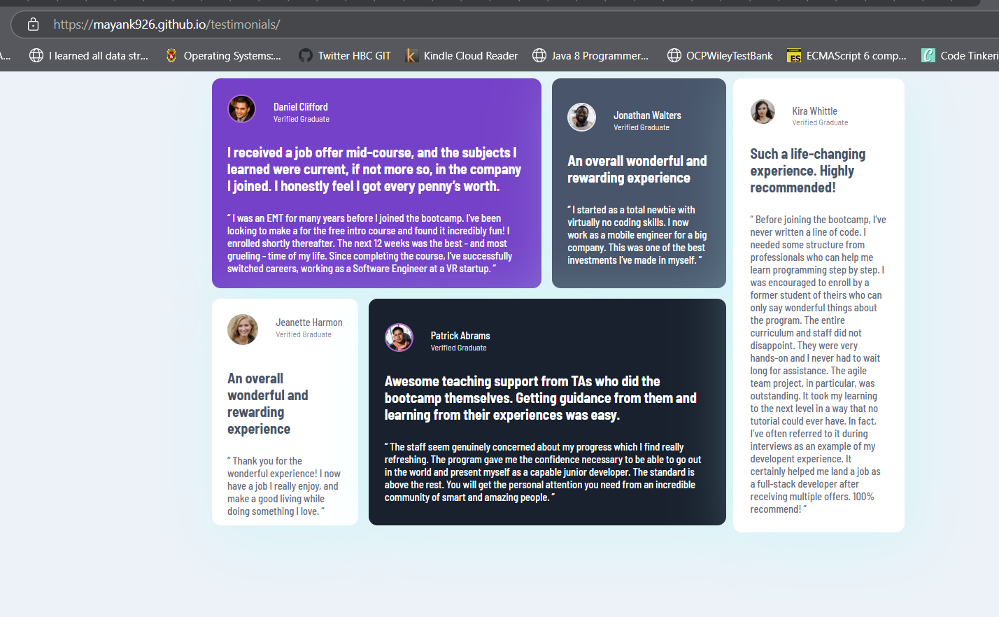

# Frontend Mentor - Testimonials grid section solution

This is a solution to the [Testimonials grid section challenge on Frontend Mentor](https://www.frontendmentor.io/challenges/testimonials-grid-section-Nnw6J7Un7). Frontend Mentor challenges help you improve your coding skills by building realistic projects. 

## Table of contents

- [Overview](#overview)
  - [The challenge](#the-challenge)
  - [Screenshot](#screenshot)
  - [Links](#links)
- [My process](#my-process)
  - [Built with](#built-with)
  - [What I learned](#what-i-learned)
  - [Continued development](#continued-development)
  - [Useful resources](#useful-resources)
- [Author](#author)
- [Acknowledgments](#acknowledgments)

## Overview

### The challenge

Users should be able to:

- View the optimal layout for the site depending on their device's screen size

### Screenshot
- Desktop View

- Mobile View


### Links

- Solution URL: [Git Repo Link](https://github.com/Mayank926/testimonials)
- Live Site URL: [Hosted solution link](https://mayank926.github.io/testimonials/)

## My process

### Built with

- Semantic HTML5 markup
- CSS custom properties
- Flexbox
- Mobile-first workflow

### What I learned

- Learned about media Type
```css
@media (min-width: 576px) {
    .fl-container-main{
        display: flex;
        flex-direction: row;
        justify-content: flex-start;
        align-items: center;
        width: 800px;
        height: auto;
    }
}
```
- Learned about flex justify content and align-item
```css
.fl-container-box{
        display: flex;
        flex-direction: column;
        justify-content: center;
        align-items: center;
}
```
- Learned how to provide circular border to an image

```css
#DanielBox .personalSection-Image{
    border: 2px solid hsl(281, 52%, 61%);
}
```
